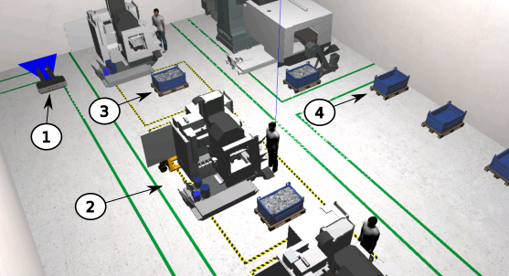
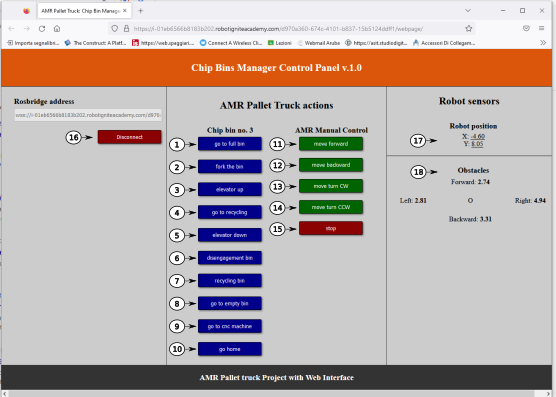

# amr_pallet_trucks project
## Table of Contents
- [1. Overview](#heading--1)
- [2. Installation](#heading--2)
    - [2.1 Run on PC](#heading--2-1)
    - [2.2 Run on Docker Container](#heading--2-2)
- [3. Usage](#heading--3)

<div id="heading--1"/>

### 1. Overview
The four industrial revolution (4IR) pushes the manufacturing industry to an integration with newest technologies like the Artificial Intelligence, additive manufacturing, augmented reality and the IoT internet of things. The 4IR also includes an advanced in connectivity between machines, robots, sensors, etc. that gives rise to “smart factories”.

The following project refers to a smart factory in which the IoT, the advanced connectivity and the ROS technology allow an autonomous management of the raw and waste materials. In particular, the environment, shown in the figure 1.1, reproduces a mechanical workshop for working metals with numerical control machines, where an AMR pallet truck ensures the handling of both raw or semi-finished pieces and the transport of residual metal shaving.

<p align="center">

</p>

<h4 align="center">
Figure 1.1: Mechanical workshop environment. (1) AMR pallet trucks, (2) CNC machine, (3) full chip bin, (4) empty chip bin.
</h4>

In the following scenario, it is staged an example of management of the residual metal chip bin by the AMR pallet truck using a web interface, as shown in figure 1.2. It leaves the fully automatic management to a later implementation.

<p align="center">

</p>

<h4 align="center">
Figure 1.2: Web Interface. Buttons: (1) go to full bin, (2) fork the bin, (3) elevator up, (4) go to recycling, (5) elevator down, (6) disengagement bin, (7) recycling bin, (8) go to empty bin, (9) go to CNC machine, (10) go home, (11) move forward, (12) move backward, (13) move turn CW, (14) move turn CCW, (15) stop, (16) connect/disconnect. Readings: (17) odometry position, (18) obstacle distances.
</h4>

The project, created using ROS Noetic and Python language, has been divided into four main parts:
 - Gazebo simulation 
 - chip bin management
 - navigation 
 - usage

The first part concerns the construction of the AMR and its environment, i.e. the mechanical workshop with CNC machines and the chip bins. The second one is dealing with the actions of the AMR, like: the detection, the engagement and the disengagement of the chip bin. The third regards the transport of both empty and full europallets. The last one is an explanation on how to do a chip bin replacement cycle using a web interface. To achive these objectives  9 packages were created, grouped as follows:

 - **Gazebo simulation** 
     - amr_description
     - amr_environment     
 - **chip bin management**
      - amr_detection
      - amr_rendezvous
      - amr_disengagement  
      - amr_webpage
 - **navigation**
      - amr_mapping
      - amr_localization
      - amr_navigation
 - **usage**
 
[go to top](#amr_pallet_trucks-project)

<div id="heading--2"/>

### 2. Installation

<div id="heading--2-1"/>

### 2.1 Run on PC
The AMR_pallet_trucks project runs at least on UBUNTU 20.04 LTS and ROS Noetic. Refer to https://ubuntu.com/download/desktop and  https://wiki.ros.org/noetic/Installation/Ubuntu to install them.

Install the following packages:
```
sudo apt-get update
sudo apt-get install ros-noetic-navigation
sudo apt-get install ros-noetic-rosbridge-suite
sudo apt-get install ros-noetic-ros-control ros-noetic-ros-controllers
sudo ln -s /usr/bin/python3 /usr/bin/python
```
Open a terminal and type

```
cd ~/catkin_ws/src
git clone https://github.com/motomechatronics/amr_pallet_trucks.git
cd ..
catkin_make
source devel/setup.bash
export NVM_DIR="/home/user/catkin_ws/src/amr_pallet_trucks/webpage_ws/nvm"

```
Edit main_project.launch file, with
```
cd ~/catkin_ws/src/amr_pallet_trucks/amr_description/launch
vim main_project.lauch
```
Comment this line and save the file.
```
<!--arg name="websocket_external_port" value="$(env SLOT_ROSBRIDGE_PORT)" /-->
```
Next, edit the .bashrc file
```
vim ~/.bashrc
```
At the end of the file, (press i) copy and paste:
```
source /opt/ros/noetic/setup.bash
source /usr/share/gazebo/setup.sh
export GAZEBO_RESOURCE_PATH=usr/share/gazebo-11/models:$HOME/catkin_ws/src/amr_pallet_trucks:$HOME/catkin_ws/src/amr_pallet_trucks/amr_environment/models:$HOME/catkin_ws/src/amr_pallet_trucks/amr_environment
export GAZEBO_MODEL_PATH=/usr/share/gazebo-11/models:$HOME/catkin_ws/src/amr_pallet_trucks:$HOME/catkin_ws/src/amr_pallet_trucks/amr_environment/models:$HOME/catkin_ws/src/amr_pallet_trucks/amr_environment
export NVM_DIR="$HOME/catkin_ws/src/amr_pallet_trucks/amr_webpage/nvm"
[ -s "$NVM_DIR/nvm.sh" ] && \. "$NVM_DIR/nvm.sh"  # This loads nvm
[ -s "$NVM_DIR/bash_completion" ] && \. "$NVM_DIR/bash_completion"  # This loads nvm bash_completion
alias webpage_address='echo http://127.0.0.1:7000'
alias rosbridge_address='echo ws://127.0.0.1:9090'
```
press esc and save typing inside **vim** environment
```
:wq!
```
In the same terminal
```
source ~/.bashrc
nvm ls
nvm install v14
nvm alias default v14
npm install -g http-server
 ```
[go to top](#amr_pallet_trucks-project)
 
<div id="heading--2-2"/>

### 2.2 Run on Docker Container

In the case you have UBUNTU installed in your PC, type
```
cd ~/catkin_ws/src
git clone https://github.com/motomechatronics/amr_pallet_trucks.git
```
Install Docker if it is not present in your system, typing
```
sudo apt-get update
sudo apt-get install docker.io docker-compose
sudo service docker start
```
Then you can already work with Docker (with sudo):
```
sudo docker ps
sudo docker images
```
To create an image of the projet, open a terminal and type:
```
cd ~/catkin_ws/src/amr_pallet_trucks/
sudo docker build -f dockerfile_amr_pallet_trucks_project -t amr_ptp:latest .
```
After that, run the image in the container, typing:
```
sudo docker run -it amr_ptp
```
Now, you should be inside the UBUNTU system like root. Type:
```
source devel/setup.bash
vim src/amr_pallet_trucks/amr_description/launch/main_project.launch 
```
Press i letter and comment the line as follow:
```
<!--arg name="websocket_external_port" value="$(env SLOT_ROSBRIDGE_PORT)" /-->
```
press esc, type :wq! and press enter.

Launch the project with:
```
roslaunch amr_description main_project.launch
```
Open another terminal and type:
```
sudo docker ps
```
You will get a list of the containers. Copy and paste the **container ID** of the image **amr_ptp** as below:   
```
sudo docker exec -it 3e31851e18ad  bash
```
Now, you can explore the project, for example you can visualize the /front_scan topic, with:
```
rostopic echo /front_scan
```
Or you can visualize the list of the topics or of the servers:
```
rostopic list
rosservice list
```
[go to top](#amr_pallet_trucks-project)

<div id="heading--3"/>

### 3. Usage
Open a terminal and type

```
cd ~/catkin_ws
source devel/setup.bash
roslaunch amr_description main_project.launch
```

Open another terminal and type

```
cd ~/catkin_ws/src/amr_pallet_trucks/amr_webpage/
http-server --port 7000
```

Open another terminal and type

```
webpage_address
```

You will get a web link as http://127.0.0.1:7000. Copy and paste the link in a browser. After in the same terminal type

```
rosbridge_address
```
You will get a link as ws://127.0.0.1:9090, copy and paste the string into the rosbrigde address field, shown in figure 3.1 and press the **connect** button.

<p align="center">

</p>

<h4 align="center">
Figure 3.1: Web Interface. Buttons: (1) go to full bin, (2) fork the bin, (3) elevator up, (4) go to recycling, (5) elevator down, (6) disengagement bin, (7) recycling bin, (8) go to empty bin, (9) go to CNC machine, (10) go home, (11) move forward, (12) move backward, (13) move turn CW, (14) move turn CCW, (15) stop, (16) connect/disconnect. Readings: (17) odometry position, (18) obstacle distances.
</h4>

At the moment the project manages only one bin, not selectable. The procedure to stage a substitution cycle is the following:
- press the **go to full bin** button, the expected result is shown in figure 3.2.

<p align="center">

</p>

<h4 align="center">
Figure 3.2: result of pressing the go to full bin button.
</h4>

after that, 
- press the **fork the bin** button and next the **elevator up** button, the expected result is shown in figure 3.3.

<p align="center">

</p>

<h4 align="center">
Figure 3.3: result of pressing the fork the bin and the elevator up buttons.
</h4>

- press the **go to recycling** button and next the **elevator down** button, the expected result is shown in figure 3.4.

<p align="center">

</p>

<h4 align="center">
Figure 3.4: result of pressing the go to recycling and the elevator down buttons.
</h4>

- press the **disengagement** button and when the AMR will be disengaged, press the **recycling bin** and the **go to empty bin** buttons. The expected result is shown in figure 3.5.

<p align="center">

</p>

<h4 align="center">
Figure 3.5: result of pressing the disengagement bin, the recycling bin and the go to empty bin buttons.
</h4>

- press the **fork the bin** button and, when the chip bin is forked, press **elevator up** button. The expected result is shown in figure 3.6.

<p align="center">

</p>

<h4 align="center">
Figure 3.6: result of pressing the go to empty bin button.
</h4>

- press the **go to cnc machine** button and next the **elevator down** button, the expected result is shown in figure 3.7.

<p align="center">

</p>

<h4 align="center">
Figure 3.7: result of pressing the go to cnc machine and the elevator down buttons.
</h4>

- by pressing the **disengagement** and the **go home** buttons the cycle ends. The expected result is shown in figure 3.8.

<p align="center">

</p>

<h4 align="center">
Figure 3.8: result of pressing the disengagement and the go home buttons.
</h4>

[go to top](#amr_pallet_trucks-project)
